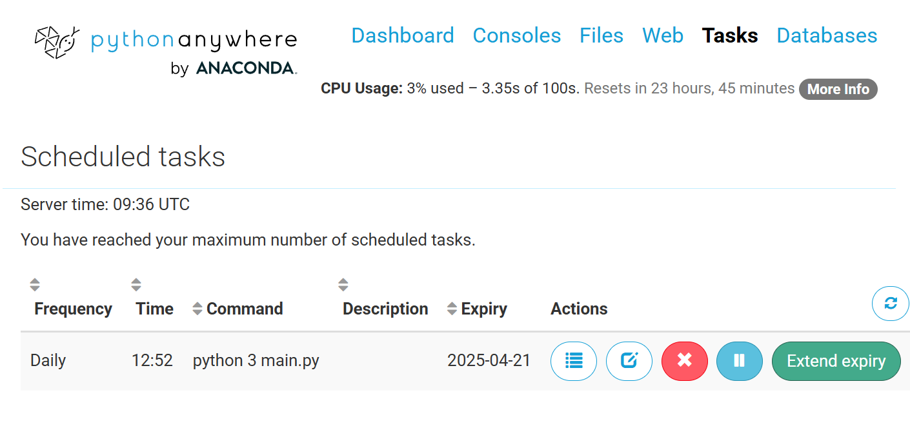

# Open Weather API - SMS Rain Alert

This project makes daily scheduled SMS messages indicating whether you should bring an umbrella today based on forecast.

This project uses the [Weather API](https://openweathermap.org/api) to fetch API parameters for a key and geographic location. The 3 cities featured in this app is Calgary, Toronto Canada and Odense, Denmark which are my home cities.  

Afterward an SMS message will be sent to the user using the [Twilio API SMS Service](https://www.twilio.com/docs/libraries/reference/twilio-python/). Twilio library had to be installed for this API.

To schedule the daily reminder, [Python Anywhere](https://www.pythonanywhere.com) is used as a service to upload the code and have it run automatically at 7am each morning. 

### Documentation:
- [Weather API Website](https://openweathermap.org/api)
- [5-day weather forecast API Docs](https://openweathermap.org/forecast5)
- [Twilio API SMS Messaging](https://www.twilio.com/docs/libraries/reference/twilio-python/)
- [Python Anywhere Website](https://www.pythonanywhere.com)
 
### API Endpoint:
- **URL**: [Calgary Canada Param Current Weather](https://api.openweathermap.org/data/2.5/forecast?lat=51.0460954&lon=-114.065465&appid=APIKEY)
- **URL**: [Odense Denmark Param Current Weather](https://api.openweathermap.org/data/2.5/forecastlat=55.3997225&lon=10.3852104&appid=APIKEY)
- **URL**: [Toronto Canada Param Current Weather](https://api.openweathermap.org/data/2.5/forecastlat=43.6532255&lon=-79.383186&appid=APIKEY)

#### Python Anywhere Screenshot:

## Modules/Libraries

- `requests`: Used for making HTTP requests to fetch data from the API.
- `twilio`: The core Twilio library used for sending SMS, making calls, and managing Twilio services.

